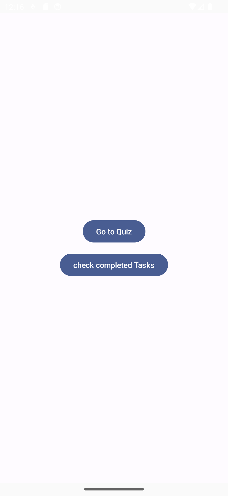

# Overview
This is a template project for a quiz app.<br>

# env
- IDE
```
Android Studio Giraffe | 2022.3.1
Build #AI-223.8836.35.2231.10406996, built on June 29, 2023
Runtime version: 17.0.6+0-17.0.6b829.9-10027231 x86_64
VM: OpenJDK 64-Bit Server VM by JetBrains s.r.o.
macOS 13.4.1
GC: G1 Young Generation, G1 Old Generation
Memory: 1280M
Cores: 16
Metal Rendering is ON
Registry:
    external.system.auto.import.disabled=true
    ide.text.editor.with.preview.show.floating.toolbar=false
```
- Support OS version: 10.0 later

# features
- Material 3 (Custom)
- product flavor
  - Ability to quickly create multiple versions of your app. 
- multi module
  - for a clean architecture.

# Demo App 01 (TriviaQuizApp)
## capture: Phone API 30
| top                                                    | quiz                                                    | completed                                                    |
|--------------------------------------------------------|---------------------------------------------------------|--------------------------------------------------------------|
|  |  |  |

## capture: Tablet API 34
| top                                                     | quiz                                                     | completed                                                     |
|---------------------------------------------------------|----------------------------------------------------------|---------------------------------------------------------------|
|  |  |  |


## capture: Foldable API 34
| top                                                       | quiz                                                       | completed                                                       |
|-----------------------------------------------------------|------------------------------------------------------------|-----------------------------------------------------------------|
|  |  |  |

# Demo App 02 (ArithQuizApp)
## capture: Phone API 34
| top                                                   | quiz                                                   | completed                                                   |
|-------------------------------------------------------|--------------------------------------------------------|-------------------------------------------------------------|
|  |  |  |

## capture: Tablet API 34
| top                                                    | quiz                                                    | completed                                                    |
|--------------------------------------------------------|---------------------------------------------------------|--------------------------------------------------------------|
|  |  |  |


## capture: Foldable API 34
| top                                                      | quiz                                                      | completed                                                      |
|----------------------------------------------------------|-----------------------------------------------------------|----------------------------------------------------------------|
|  |  |  |

